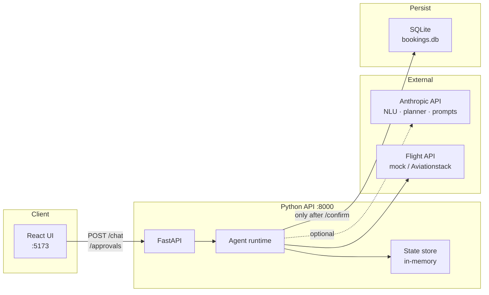
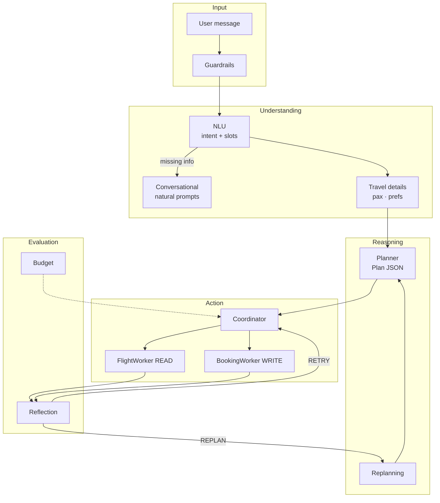
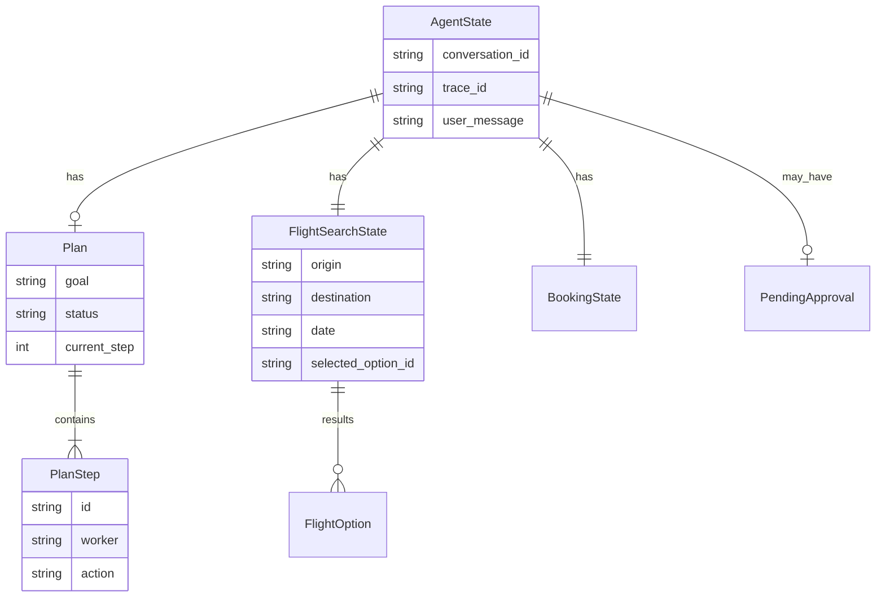
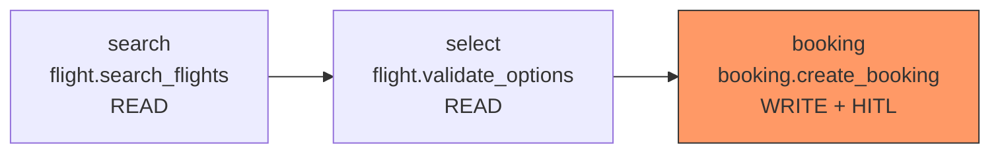
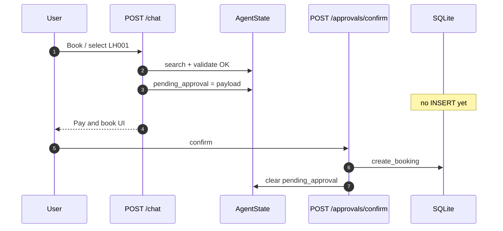
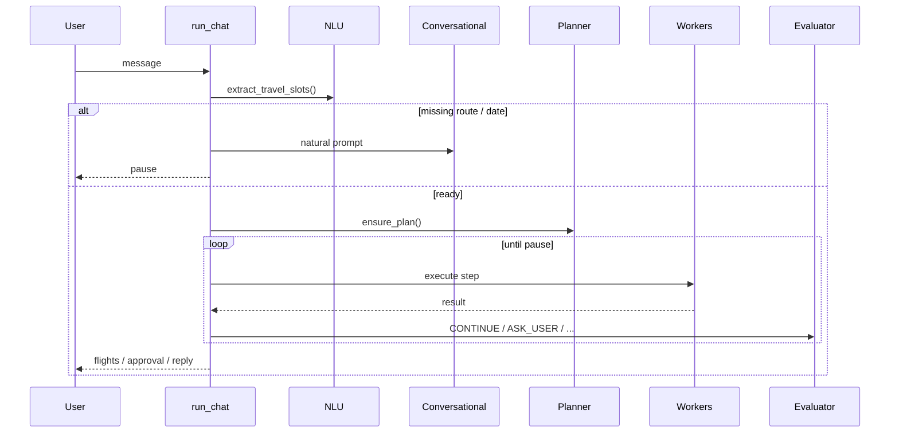

# Pilot Flight Agent

Stateful agentic flight booking with structured planning, workers, MCP, and human-in-the-loop approval.

The agent accepts English or Albanian chat messages, builds a structured plan, executes flight and booking workers, and pauses for human approval before any write to the booking store.

## Features

- FastAPI API with `POST /chat`, approval endpoints, and structured logging
- Agent loop with plan execution, reflection, replanning, and budget limits
- NLU + conversational prompts (Claude or mock heuristics) for natural EN/SQ chat
- Mock flight API and mock planner for local development (no API keys required)
- Human-in-the-loop booking approval before SQLite writes
- Input/output guardrails, rate limiting, and prompt-injection detection
- MCP tool integration (`TOOLS_MODE=direct` or `TOOLS_MODE=mcp`)
- Eval suite with metrics, regression gate, and JSON/Markdown reports

## Prerequisites

- **Python 3.11+**
- **pip** and **venv**

Optional (only for live integrations):

- `ANTHROPIC_API_KEY` — real NLU, conversational replies, and planning (`NLU_USE_MOCK=false`, `PLANNER_USE_MOCK=false`)
- Lufthansa / Aviationstack credentials — live flight data (`FLIGHT_API_USE_MOCK=false`)

## System design

**What the system does:** accepts natural-language messages (EN/SQ), extracts intent and route, builds a structured plan, runs flight search, and **pauses for human approval** before any database write. Each conversation (`conversation_id`) holds full state — this is not a stateless chat API.

### 1. High-level view (containers)



| Component | Purpose |
|-----------|---------|
| **React UI** | Chat, seat selection, approval screen — calls the API via `/api` proxy |
| **FastAPI** | HTTP, guardrails, rate limits, trace_id — no heavy business logic |
| **Agent runtime** | NLU → clarification → plan → workers → reflection — core product logic |
| **State store** | `AgentState` per `conversation_id` (plan, flights, pending approval) |
| **Anthropic** | When `*_USE_MOCK=false`: understands text, plans steps, generates natural prompts |
| **Flight API** | Returns schedules (mock or live); mock mode has no reliable pricing |
| **SQLite** | Bookings only after `POST /approvals/confirm` |

---

### 2. Agent layers



| Layer | Module | Purpose |
|-------|--------|---------|
| **Guardrails** | `app/guardrails/` | Blocks unsafe input, rate-limits, sanitizes output |
| **NLU** | `app/agent/nlu.py` | Extracts structured slots — not customer-facing copy |
| **Conversational** | `app/agent/conversational_prompts.py` | Natural chat text for questions (no airport codes in copy) |
| **Travel details** | `app/agent/travel_details.py` | Before book: one-way/round-trip, passengers, preferences |
| **Planner** | `app/agent/planning.py` | Steps: search → validate → create_booking |
| **Coordinator** | `app/agent/coordinator.py` | Runs each step; WRITE → `pending_approval`, not DB |
| **Reflection** | `app/agent/reflection.py` | After each step: continue, retry, replan, ask user, fail |

---

### 3. Schema: `AgentState` (conversation state)



| Field | Purpose |
|-------|---------|
| `plan` | Current steps and status (pending / in_progress / completed) |
| `flight_search` | Route, date, results, selected flight |
| `pending_approval` | Payload for the UI — **no SQLite INSERT until the user confirms** |
| `pending_question` | Last question to the user (clarification / flight selection) |
| `reflection_history` | What the evaluator decided after each step |
| `tool_history` | Log of READ tool calls (search, validate) |

---

### 4. Schema: NLU → `TravelSlots`

```json
{
  "intent": "search_flights | book_flight | greeting | other",
  "origin": "TIA",
  "destination": "FRA",
  "travel_date": "2025-09-15",
  "trip_type": "one_way | round_trip",
  "passengers": 1,
  "needs_clarification": false
}
```

| Slot | Purpose |
|------|---------|
| `intent` | Search vs book vs greeting |
| `origin` / `destination` | IATA **inside the system** — the user sees city names in chat |
| `needs_clarification` | If true → loop pauses and asks via the conversational layer |

---

### 5. Schema: plan (`Plan` → workers)



| Step | Purpose |
|------|---------|
| **search** | Call API / mock → `FlightOption` list stored in state |
| **select** | Pick an option ("LH001", "first one") |
| **booking** | **Does not write** — sets `pending_approval`, waits for `/confirm` |

**Evaluator:**

| Status | Purpose |
|--------|---------|
| `CONTINUE` | Next step |
| `ASK_USER` | Pause (flight list, unavailable pricing) |
| `RETRY` / `REPLAN` / `FAIL` | Retry / new plan / error |

---

### 6. Human-in-the-loop (database writes)



| Endpoint | Purpose |
|----------|---------|
| `POST /chat` | New turn — READ tools only + pending approval |
| `POST /approvals/confirm` | Only allowed path to write to the DB |
| `POST /approvals/cancel` | Clears approval, no DB write |

---

### 7. Chat turn (one message)



---

### 8. Modes (dev vs prod)

| Flag | `true` | `false` |
|------|--------|---------|
| `NLU_USE_MOCK` | Regex + city lists | Claude NLU |
| `PLANNER_USE_MOCK` | Mock plan | Claude plan JSON |
| `FLIGHT_API_USE_MOCK` | 3 mock LH flights | Aviationstack / Lufthansa |
| `TOOLS_MODE` | `direct` | `mcp` stdio |

Values in `.env` take precedence over shell env for `NLU_USE_MOCK` / `PLANNER_USE_MOCK`.

---

Further reading: [docs/architecture.md](docs/architecture.md) · [docs/guardrails.md](docs/guardrails.md) · [docs/threat-model.md](docs/threat-model.md)

## Quick start

From an empty checkout to a working local server in a few minutes:

```bash
# 1. Create and activate a virtual environment
python -m venv .venv

# Windows
.\.venv\Scripts\activate

# macOS / Linux
# source .venv/bin/activate

# 2. Install dependencies
pip install -r requirements.txt

# 3. Configure environment (defaults work out of the box)
copy .env.example .env        # Windows
# cp .env.example .env        # macOS / Linux

# 4. Run the API
python -m app.main
```

The server starts at [http://localhost:8000](http://localhost:8000).

Verify it is running:

```bash
curl http://localhost:8000/health
# {"status":"ok"}
```

## Docker

Run the API in a container (mock planner + mock flights, no API keys):

```bash
docker compose up --build
```

Verify health from the host:

```bash
curl http://localhost:8000/health
# {"status":"ok"}
```

Stop the stack:

```bash
docker compose down
```

Notes:

- Bookings persist in the named Docker volume `booking-data` (`BOOKING_DB_PATH=/app/data/bookings.db`).
- Override settings via environment variables in `docker-compose.yml` or a local `.env` file (e.g. `TOOLS_MODE=mcp`).
- For MCP mode in Docker, `MCP_PYTHON_EXECUTABLE=/usr/local/bin/python` is set in the image.

## Frontend

Luxury landing UI (glass booking coupon + seat picker + agent chat):

```bash
# Terminal 1 — API
python -m app.main

# Terminal 2 — UI (http://localhost:5173)
cd frontend
npm install
npm run dev
```

The UI proxies `/api` to the backend via Vite. Set `CORS_ORIGINS` in `.env` if you call the API directly from the browser.

## Configuration

Copy `.env.example` to `.env` and adjust as needed. Important defaults for local dev:

| Variable | Default | Purpose |
|----------|---------|---------|
| `NLU_USE_MOCK` | `true` | Heuristic NLU (no Anthropic key); `false` = Claude NLU + conversational prompts |
| `PLANNER_USE_MOCK` | `true` | Use built-in planner (no Anthropic key) |
| `FLIGHT_API_USE_MOCK` | `true` | Use mock flight search results |
| `TOOLS_MODE` | `direct` | Call tools in-process (`mcp` for MCP servers) |
| `BOOKING_DB_PATH` | `data/bookings.db` | SQLite booking store |
| `RATE_LIMIT_ENABLED` | `true` | Per-IP and per-conversation limits |
| `DEBUG` | `false` | Set `true` to expose cost debug in `/chat` responses |

See `.env.example` for the full list of guardrail, reliability, and budget settings.

## Run the API

```bash
# Development (uses HOST/PORT/DEBUG from .env)
python -m app.main

# Or with uvicorn directly
uvicorn app.main:app --reload --host 0.0.0.0 --port 8000
```

Interactive docs: [http://localhost:8000/docs](http://localhost:8000/docs)

## Example requests

Search flights (mock mode returns TIA → FRA results):

```bash
curl -X POST http://localhost:8000/chat \
  -H "Content-Type: application/json" \
  -d "{\"message\": \"Find flights TIA to FRA on 2025-09-15\"}"
```

The response includes `conversation_id`, `trace_id`, agent message text, and `pending_approval` when a booking needs confirmation.

Confirm a pending booking:

```bash
curl -X POST http://localhost:8000/approvals/confirm \
  -H "Content-Type: application/json" \
  -d "{\"conversation_id\": \"YOUR_CONVERSATION_ID\"}"
```

Cancel a pending booking:

```bash
curl -X POST http://localhost:8000/approvals/cancel \
  -H "Content-Type: application/json" \
  -d "{\"conversation_id\": \"YOUR_CONVERSATION_ID\"}"
```

## Run tests

```bash
pytest
```

Run a focused subset:

```bash
pytest tests/test_chat.py tests/test_booking.py -q
```

## Run evals

Full eval suite (16 cases):

```bash
pytest tests/test_eval_runner.py tests/test_eval_metrics.py -q
```

Regression gate (10 critical cases):

```bash
pytest tests/test_eval_regression.py -q
```

Generate a Markdown + JSON eval report from Python:

```python
from evals.regression import run_regression_evals
from evals.report import write_eval_report

summary = run_regression_evals(enforce_thresholds=False)
write_eval_report(summary, "reports", stem="regression-report", run_type="regression")
```

Outputs `reports/regression-report.json` and `reports/regression-report.md`.

## Project layout

```
app/           FastAPI app, agent loop, workers, guardrails, tools
frontend/      React UI — landing, booking coupon, seat picker, chat
evals/         Datasets, runners, metrics, regression gate, reports
tests/         Unit and integration tests
docs/          Architecture, decisions, guardrails, threat model
data/          SQLite booking database (created at runtime)
```

## Documentation

- [ENGINEERING_LOG.md](ENGINEERING_LOG.md) — incremental build log
- [docs/architecture.md](docs/architecture.md) — system design
- [docs/decisions.md](docs/decisions.md) — architecture decision records
- [docs/guardrails.md](docs/guardrails.md) — security guard chain
- [docs/threat-model.md](docs/threat-model.md) — threat model

## License

Internal / portfolio project — add a license if you publish the repository.
