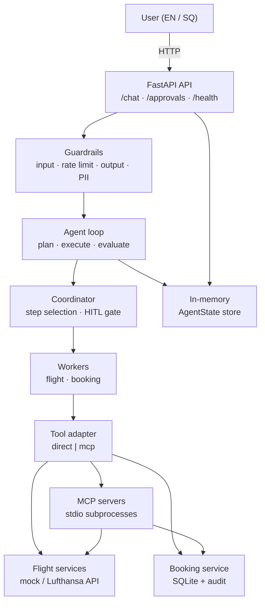
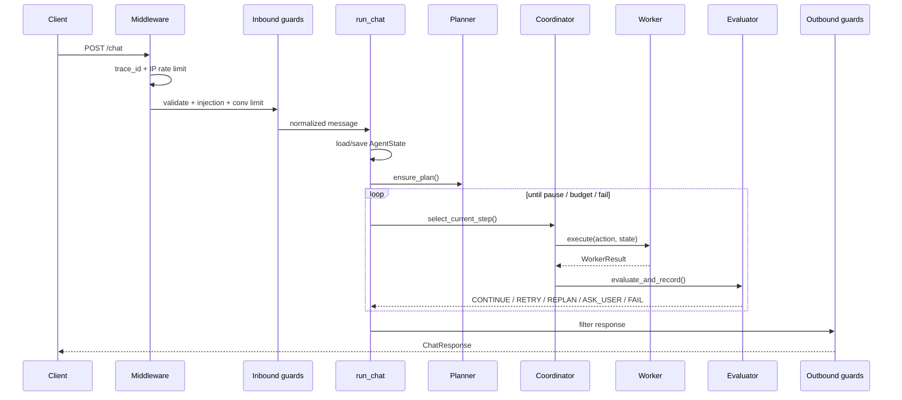
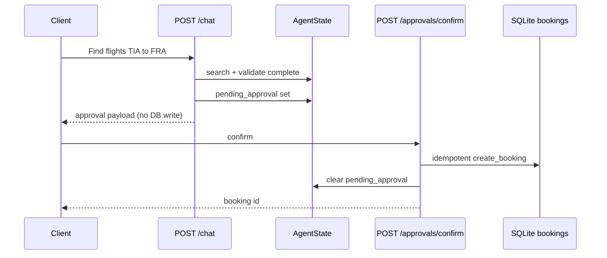

# Architecture

System design for the Pilot Flight Agent — aligned with the current codebase.

## Overview

The system is a **stateful agentic flight booking API**. Users send natural-language messages in English or Albanian. The runtime plans structured steps, delegates to domain workers, evaluates each step, and returns a response. **Write operations** (booking creation) require explicit human approval before any SQLite write.

Design goals:

- Thin HTTP layer; business logic lives in the agent runtime
- Single source of truth: `AgentState` per conversation
- Workers invoke tools through a swappable adapter (`direct` or `mcp`)
- Security at the API boundary, not only inside prompts
- Observable requests via `trace_id`, spans, metrics, and audit logs

## High-level architecture



## Request flow

### `POST /chat`



### Human-in-the-loop booking

Write tools (`create_booking`) never persist during `/chat`. The coordinator queues `pending_approval` on `AgentState` and stops the turn.



Cancel via `POST /approvals/cancel` clears approval state and skips the booking step without touching SQLite.

## Agent runtime

| Component | Module | Responsibility |
|-----------|--------|----------------|
| **Loop** | `app/agent/loop.py` | One chat turn: load state, plan, execute until pause, save state |
| **Coordinator** | `app/agent/coordinator.py` | Pick next step, delegate to worker, queue WRITE approvals |
| **Planner** | `app/agent/planning.py` | Mock or LLM planner → structured `Plan` JSON |
| **Evaluator** | `app/agent/reflection.py` | After each step: CONTINUE, RETRY, REPLAN, ASK_USER, FAIL |
| **Replanning** | `app/agent/replanning.py` | Replace plan when evaluator requests REPLAN |
| **Budget** | `app/agent/budget.py` | Iteration, tool, LLM, token, latency limits |
| **State store** | `app/agent/state.py` | In-memory `AgentState` per `conversation_id` |

### Default flight plan

Typical mock/LLM plan for a search-and-book intent:

```
search (flight.search_flights)
  └─ select (flight.validate_options)
       └─ booking (booking.create_booking)  ← WRITE, HITL
```

The coordinator runs READ steps immediately. The booking step sets `pending_approval` instead of calling the booking worker.

### Evaluation outcomes

| Status | Loop behavior |
|--------|----------------|
| `CONTINUE` | Run next plan step |
| `RETRY` | Re-run same step (up to `MAX_STEP_RETRIES`) |
| `REPLAN` | Replace plan via planner (up to `MAX_REPLAN_ATTEMPTS`) |
| `ASK_USER` | Pause with `pending_question` (e.g. cheapest-fare intent) |
| `FAIL` | Stop turn with graceful error message |

## Workers and tools

Workers implement a shared contract in `app/agent/workers/base.py` and call a **tool adapter** — never raw HTTP or SQLite directly from the coordinator.

| Worker | Actions | Permission |
|--------|---------|------------|
| `FlightWorker` | `search_flights`, `validate_options` | READ |
| `BookingWorker` | `create_booking` | WRITE (approval required) |

### Tool modes (`TOOLS_MODE`)

| Mode | Path | Use case |
|------|------|----------|
| `direct` | `DirectToolAdapter` → `flight_service` / `booking_service` | Default local dev |
| `mcp` | `McpToolAdapter` → `RemoteMcpClient` → stdio MCP servers | MCP integration |

MCP servers live under `app/mcp/servers/` (`lufthansa_server`, `booking_server`). The adapter choice is config-only; coordinator and workers stay unchanged.

## State model

`AgentState` (`app/agent/state.py`) is the session record:

| Area | Fields |
|------|--------|
| Session | `conversation_id`, `trace_id`, `user_message`, `language` |
| Planning | `plan` (`Plan`, steps, statuses) |
| Domain | `flight_search`, `booking` |
| Control | `pending_approval`, `pending_question`, `iteration_count` |
| History | `tool_history`, `reflection_history` |
| Budget | `step_retry_counts`, `replan_count`, token/LLM counters |

State persists in an in-memory store (development/tests). HTTP handlers and `run_chat()` share the same store via `get_state_store()`.

## Security architecture

Guards run at the **API boundary** (`app/guardrails/chain.py`), before and after the agent loop.

**Inbound (`POST /chat`)**

1. IP rate limit — `RateLimitMiddleware`
2. Input validation — length, whitespace, control characters
3. Prompt injection heuristics — block or warn
4. Per-conversation rate limit — `run_inbound_chat_guards()`

**Outbound**

1. Output guard — block tracebacks, redact secrets/paths
2. PII redaction — emails, phone numbers in user-visible text

**Write safety**

- Permission registry in `app/guardrails/permissions.py` (READ vs WRITE)
- WRITE actions require `pending_approval` + `/approvals/confirm`
- Idempotent booking writes via `idempotency_key` (`app/core/idempotency.py`)
- Booking audit trail in SQLite (`app/tools/booking_audit.py`)

See [guardrails.md](guardrails.md) and [threat-model.md](threat-model.md) for detail.

## Observability

Every HTTP request gets a `trace_id` (`X-Trace-Id` header).

| Layer | Module | Emits |
|-------|--------|-------|
| Middleware | `app/core/middleware.py` | Request start/complete, latency |
| Tracing | `app/core/tracing.py` | Spans: request, plan, worker, tool |
| Metrics | `app/core/metrics.py` | Turn/session tool and LLM counters |
| Cost | `app/core/cost.py` | Token usage (debug payload when `DEBUG=true`) |
| Logging | `app/core/logging.py` | Structured JSON logs with `trace_id` |

## Reliability

| Mechanism | Module |
|-----------|--------|
| Retries with backoff | `app/core/retry.py` |
| Circuit breaker | `app/core/circuit_breaker.py` |
| Timeouts | `app/core/timeout.py` |
| Graceful errors | `app/core/errors.py` |
| Agent budget | `app/agent/budget.py` |

Failed external calls map to user-safe messages; circuit-open failures surface as evaluator `FAIL`, not raw stack traces.

## API surface

| Method | Path | Purpose |
|--------|------|---------|
| `GET` | `/health` | Liveness |
| `POST` | `/chat` | User message → agent turn |
| `GET` | `/approvals/pending` | Read structured approval payload |
| `POST` | `/approvals/confirm` | Execute approved WRITE |
| `POST` | `/approvals/cancel` | Abort pending WRITE |

Routers: `app/api/router.py` aggregates `health`, `chat`, and `approvals`.

## Evaluations

The `evals/` package provides offline quality checks:

| Piece | Location |
|-------|----------|
| Datasets | `evals/datasets/*.json` |
| HTTP runner | `evals/runners/http_runner.py` |
| Metrics | `evals/metrics/scoring.py` |
| Regression gate | `evals/regression.py` + `regression.json` |
| Reports | `evals/report.py` |

## Module map

```
app/
├── main.py              FastAPI app, middleware, lifespan
├── config.py            Settings from environment
├── api/                 HTTP routers (thin handlers)
├── agent/               Loop, coordinator, planning, reflection, workers
├── guardrails/          Input/output guards, permissions, approval
├── tools/               Flight/booking services, adapters, SQLite store
├── mcp/                 MCP client, stdio transport, servers
├── core/                Logging, tracing, metrics, retry, circuit breaker
└── models/              Pydantic domain models

evals/                   Datasets, runners, metrics, reports
tests/                   Pytest suite (452+ tests)
docs/                    Architecture, ADRs, guardrails, threat model
```

## Related docs

- [decisions.md](decisions.md) — architecture decision records
- [guardrails.md](guardrails.md) — guard chain and permission model
- [threat-model.md](threat-model.md) — security threats and mitigations
- [../README.md](../README.md) — setup and run instructions
- [../ENGINEERING_LOG.md](../ENGINEERING_LOG.md) — build history
