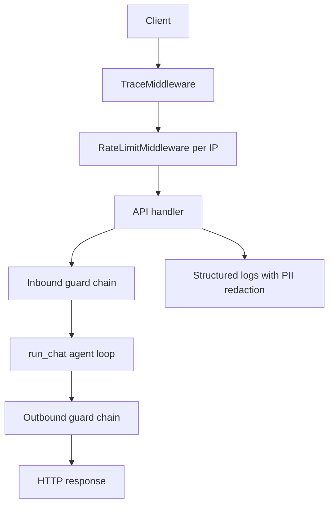

# Security guardrails

This document describes the guard chain enforced at the API boundary. Security runs
**before** the agent loop (`run_chat`) and **after** it on every user-facing response,
not only inside LLM prompts or tool wrappers.

## Request flow

## Inbound chain

| Step | Where | Module | Config |
|------|-------|--------|--------|
| Per-IP rate limit | Middleware | `app/core/middleware.py` | `RATE_LIMIT_*` |
| Input validation | `POST /chat` | `app/guardrails/input_guard.py` | `MIN/MAX_USER_MESSAGE_LENGTH` |
| Prompt injection | `POST /chat` | `app/guardrails/input_guard.py` | `PROMPT_INJECTION_*` |
| Per-conversation rate limit | `/chat`, `/approvals/*` | `app/guardrails/rate_limit.py` | `RATE_LIMIT_CONVERSATION_REQUESTS` |

Orchestration lives in `app/guardrails/chain.py`:

- `run_inbound_chat_guards()` — steps 2–4 for chat (step 1 already ran in middleware)
- `run_inbound_approval_guards()` — conversation rate limit for confirm/cancel

Failures:

- Invalid or suspicious input → **400**
- Rate limit exceeded → **429** with `Retry-After`

## Outbound chain

Applied via `run_outbound_guards()` in `app/guardrails/chain.py` (delegates to
`safe_user_message()`):

| Step | Module | Config |
|------|--------|--------|
| Output guard | `app/guardrails/output_guard.py` | `OUTPUT_GUARD_ENABLED` |
| PII redaction | `app/guardrails/pii.py` | `PII_REDACTION_ENABLED` |

## Human-in-the-loop

Write tools (`create_booking`) are gated separately:

- Permission check — `app/guardrails/permissions.py`
- Approval queue — `app/guardrails/approval.py`
- Confirm/cancel — `app/agent/approval_flow.py`

READ tools execute immediately; WRITE tools pause until the user confirms.

## Direct `run_chat()` calls

Unit and integration tests may call `run_chat()` directly without inbound guards.
Production traffic must always go through the API handlers so the inbound chain runs
first.
