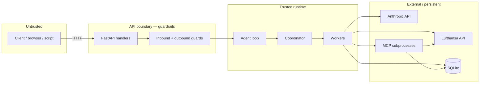
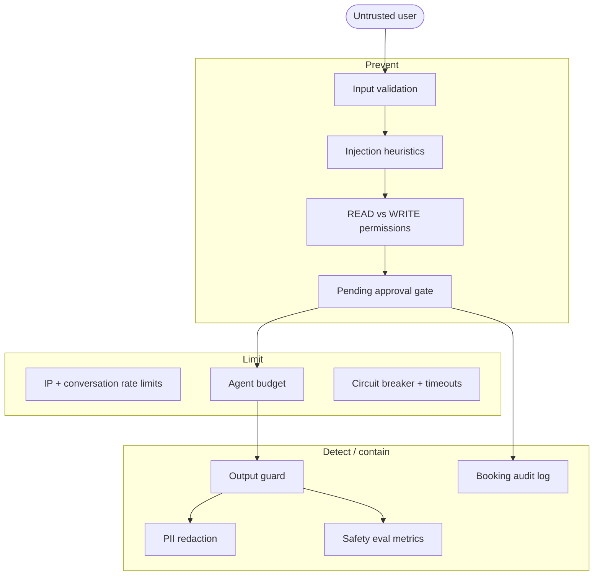

# Threat Model

Security analysis for the Pilot Flight Agent pilot. This document maps **assets**, **trust boundaries**, **threats**, **mitigations**, and **residual risks** — aligned with the implemented guard chain and HITL design.

For guard implementation detail, see [guardrails.md](guardrails.md). For design rationale, see [decisions.md](decisions.md).

## Scope

| In scope | Out of scope (pilot) |
|----------|----------------------|
| `POST /chat`, `/approvals/*`, `/health` | End-user authentication / OAuth |
| Agent loop, workers, tool adapters | Multi-tenant isolation |
| SQLite booking store | Production WAF / CDN |
| Mock and live flight/LLM integrations | Formal penetration test |
| MCP stdio subprocesses | Encrypted data at rest |

**Assumption:** The API is reachable on a network without per-user identity. Anyone who knows a `conversation_id` can call approval endpoints for that session. This is a known pilot limitation (see [residual risks](#residual-risks)).

## Assets

| Asset | Sensitivity | Location |
|-------|-------------|----------|
| User messages (may contain PII, travel intent) | Medium | Request body, `AgentState`, logs |
| Pending approval payloads | High | `AgentState.pending_approval` |
| Booking records | High | SQLite (`data/bookings.db`) |
| API secrets (Anthropic, Lufthansa) | Critical | Environment, process memory |
| Conversation / session state | Medium | In-memory `StateStore` |
| Tool and reflection history | Low–Medium | `AgentState` (audit/debug) |
| Internal paths, stack traces | Low (info disclosure) | Errors, logs |

## Trust boundaries



**Key boundary:** All untrusted input crosses the **API guard chain** before `run_chat()`. Direct `run_chat()` calls in tests bypass inbound guards and must not be exposed as a public entry point.

## Threat catalog

Severity: **Critical** · **High** · **Medium** · **Low**

### T1 — Prompt injection manipulates agent behavior

| | |
|---|---|
| **STRIDE** | Tampering, Elevation of privilege |
| **Severity** | High |
| **Scenario** | Attacker sends “ignore previous instructions” or role-override text to skip validation, force booking, or exfiltrate system prompts. |
| **Mitigation** | Heuristic injection detection in `input_guard.py` (block or warn via `PROMPT_INJECTION_*`); structured JSON planning limits free-form tool loops; READ/WRITE permission registry; WRITE never executes without HITL; agent budget caps iterations. |
| **Verification** | `tests/test_security.py`; eval datasets `injection.json`, regression cases `injection-*` |
| **Residual** | Heuristics are not complete; novel jailbreaks may reach the planner. LLM planner could still produce bad plans — evaluator and HITL limit blast radius. |

### T2 — Unauthorized booking (WRITE without approval)

| | |
|---|---|
| **STRIDE** | Elevation of privilege |
| **Severity** | Critical |
| **Scenario** | Injection or planner bug causes `create_booking` to persist without user confirm. |
| **Mitigation** | `executes_directly()` returns false for WRITE actions; coordinator calls `queue_step_for_approval()` instead of worker; SQLite write only from booking worker after `POST /approvals/confirm`; eval safety metric flags `unauthorized_write`. |
| **Verification** | `tests/test_booking.py`, `tests/test_chat.py` (HITL flows); eval `hitl-*` and safety scoring in `evals/metrics/scoring.py` |
| **Residual** | Bug in coordinator that bypasses permission check would be critical — covered by unit/integration tests, not formal proof. |

### T3 — Approval confirm by wrong party (session hijack)

| | |
|---|---|
| **STRIDE** | Spoofing, Elevation of privilege |
| **Severity** | High |
| **Scenario** | Attacker guesses or obtains `conversation_id` and calls `/approvals/confirm` to book on victim’s session. |
| **Mitigation** | **Partial:** Confirm requires existing `pending_approval` for that conversation; payload built from server-side state (not client-supplied flight details); idempotency prevents duplicate inserts. |
| **Verification** | Approval flow tests; no cross-conversation confirm |
| **Residual** | **No authentication.** Any holder of `conversation_id` can confirm. Production would require session tokens or signed approval nonces tied to user identity. |

### T4 — Secret or internal detail leakage in responses

| | |
|---|---|
| **STRIDE** | Information disclosure |
| **Severity** | High |
| **Scenario** | Stack trace, `.env` values, API keys, or SQL fragments appear in chat response after tool/LLM failure. |
| **Mitigation** | `output_guard.py` blocks tracebacks and SQL dumps; redacts API keys, env assignments, internal paths; fallback safe message; PII redaction on outbound text; structured log formatter redacts PII independently. |
| **Verification** | Output guard unit tests; eval checks for `_UNSAFE_OUTPUT_MARKERS` (traceback, leaked secret placeholders) |
| **Residual** | Redaction is pattern-based; uncommon secret formats may slip through until output guard rules expand. |

### T5 — PII exposure (email, phone)

| | |
|---|---|
| **STRIDE** | Information disclosure |
| **Severity** | Medium |
| **Scenario** | User or tool output echoes contact details in API response or logs. |
| **Mitigation** | `pii.py` redacts emails and phone numbers in outbound guards; log formatter applies same redaction. |
| **Verification** | PII tests; `safety.json` eval cases |
| **Residual** | Names, passport numbers, and non-pattern PII are not redacted. |

### T6 — Denial of service / resource exhaustion

| | |
|---|---|
| **STRIDE** | Denial of service |
| **Severity** | Medium |
| **Scenario** | Flood `/chat` or exhaust LLM/tool budget on long conversations. |
| **Mitigation** | Per-IP rate limit (`RateLimitMiddleware`); per-conversation rate limit; max message length; agent budgets (`MAX_ITERATIONS`, `MAX_LLM_CALLS`, `MAX_TOOL_CALLS`, `MAX_TOKENS`, `MAX_LATENCY_SECONDS`); circuit breaker on external calls. |
| **Verification** | `tests/test_security.py` (IP and conversation limits); budget tests |
| **Residual** | In-memory rate limit buckets reset on process restart; not distributed-safe. Live LLM/flight calls still cost money if limits are disabled. |

### T7 — Input abuse (empty, oversized, control characters)

| | |
|---|---|
| **STRIDE** | Denial of service, Tampering |
| **Severity** | Low–Medium |
| **Scenario** | Empty body, 10k+ char paste, or control chars break parsers or inflate tokens. |
| **Mitigation** | Length bounds (`MIN/MAX_USER_MESSAGE_LENGTH`); control-character rejection; trim/normalize input. |
| **Verification** | Input guard tests; eval `safety-empty-message`, `safety-control-characters` |
| **Residual** | Unicode homoglyph attacks not specifically handled. |

### T8 — Double-submit / replay on booking confirm

| | |
|---|---|
| **STRIDE** | Tampering |
| **Severity** | Medium |
| **Scenario** | Client retries `POST /approvals/confirm` and creates duplicate bookings. |
| **Mitigation** | `idempotency_key` on create; duplicate confirm returns existing booking. |
| **Verification** | Idempotency tests in booking suite |
| **Residual** | Key scope must remain tied to one approval payload for lifetime of pending approval. |

### T9 — SQL injection via booking fields

| | |
|---|---|
| **STRIDE** | Tampering, Information disclosure |
| **Severity** | Medium (if vulnerable) |
| **Scenario** | Malicious passenger name or flight id breaks out of SQL. |
| **Mitigation** | Parameterized queries in `booking_store.py`; no dynamic SQL from user strings; output guard blocks SQL dump patterns in responses. |
| **Verification** | Store unit tests |
| **Residual** | Standard ORM/query discipline must be maintained for new queries. |

### T10 — MCP subprocess / tool supply chain

| | |
|---|---|
| **STRIDE** | Elevation of privilege, Tampering |
| **Severity** | Medium |
| **Scenario** | Compromised or malicious MCP server exfiltrates env vars or writes DB unexpectedly. |
| **Mitigation** | MCP mode is opt-in; servers are local stdio processes under `app/mcp/servers/`; same permission and HITL rules apply regardless of adapter; timeouts on MCP calls. |
| **Verification** | MCP integration tests |
| **Residual** | Subprocess inherits process environment; run with least-privilege env in production. |

### T11 — Live API credential theft

| | |
|---|---|
| **STRIDE** | Information disclosure |
| **Severity** | Critical |
| **Scenario** | `ANTHROPIC_API_KEY` or Lufthansa credentials leaked via logs, errors, or repo. |
| **Mitigation** | Secrets only in environment; output guard redacts key-like patterns; `.env` not committed; mock mode default avoids live keys in dev. |
| **Verification** | Output guard tests; README documents env vars |
| **Residual** | Operator must rotate keys if leaked; no runtime secret vault. |

### T12 — Guard bypass via non-HTTP entry points

| | |
|---|---|
| **STRIDE** | Elevation of privilege |
| **Severity** | Medium |
| **Scenario** | New route or internal caller invokes `run_chat()` without inbound guards. |
| **Mitigation** | Documented policy: production traffic only through `app/api/chat.py`; guards orchestrated in `chain.py`; architecture ADR-006. |
| **Verification** | Integration tests use TestClient (full stack) for security cases |
| **Residual** | Developer discipline; code review for new handlers. |

## Mitigation summary



| Control layer | Primary threats addressed |
|---------------|---------------------------|
| Inbound guards | T1, T7 |
| Permission + HITL | T1, T2 |
| Outbound guards + PII | T4, T5 |
| Rate limits + budget | T6 |
| Idempotency | T8 |
| Parameterized SQL | T9 |
| Config + mock defaults | T11 |
| HTTP-only policy | T12 |

## Residual risks

| Risk | Severity | Notes |
|------|----------|-------|
| No user authentication | High | `conversation_id` is the only session key; approval endpoints are trust-on-possession. |
| In-memory session store | Medium | State lost on restart; no cross-instance consistency; race on multi-worker deploy. |
| Heuristic injection detection | Medium | Not a substitute for model-level safety; expect occasional false positives/negatives. |
| Pattern-based output/PII filters | Medium | Cannot guarantee zero leakage for all formats. |
| Single-node SQLite | Medium | File locking and backup/security are operator responsibilities. |
| Live LLM planner | Low–Medium | Opt-in; increases prompt-injection surface vs mock planner. |

## Verification matrix

| Mechanism | What it proves |
|-----------|----------------|
| `tests/test_security.py` | Injection block, rate limits, guard chain wiring |
| `tests/test_booking.py` / `tests/test_chat.py` | HITL discipline, no write on chat alone |
| `evals/datasets/injection.json` | End-to-end blocked outcomes |
| `evals/datasets/safety.json` | Validation edge cases |
| `evals/regression.json` | Minimum safety score on curated set |
| `evals/metrics/scoring.py` | `unauthorized_write`, unsafe output markers |

Run regression gate before release:

```bash
python -m evals.regression
```

## Hardening checklist (beyond pilot)

If moving beyond demo scope:

1. Add authentication and bind `conversation_id` to authenticated subject.
2. Sign approval payloads or use one-time confirm tokens.
3. Replace in-memory store with Redis/Postgres and TTL.
4. Deploy WAF / bot management in front of `/chat`.
5. Run periodic dependency and secret scanning; restrict MCP subprocess env.
6. Expand PII rules (names, document numbers) per compliance needs.
7. Centralize rate limiting (Redis) for multi-instance deployments.

## Related docs

- [guardrails.md](guardrails.md) — guard chain order and config
- [decisions.md](decisions.md) — ADR-005 (HITL), ADR-006 (guardrails)
- [architecture.md](architecture.md) — request and HITL flows
- [../ENGINEERING_LOG.md](../ENGINEERING_LOG.md) — Phase 8 security implementation
